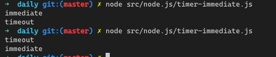

# Node.js 中的 Event Loop

> 本文基本上是对 [The Node.js Event Loop, Timers, and `process.nextTick()`](https://nodejs.org/en/docs/guides/event-loop-timers-and-nexttick/) 文章的翻译，并对照着进行一些 Node 源码的解读。
>
> An API should always be asynchronous even where it doesn't have to be.

以上是 Node.js 的一个设计哲学，而且这个理念期望贯穿于 Node.js 开发的整个生命周期中。

而且每次听到 Node.js 的介绍时，大家基本都能听到这么一句话："Node.js 是一个非阻塞事件驱动的，集成 Google V8 引擎的 JS 运行时平台。" 不知道各位第一次听到这样的介绍时是什么感受。

我第一次接触 Node.js 是在 2015 年，正式从一位 Java 开发者转到前端时，进行项目构建的时候，免不了要写一些 node 脚本，当时在官网看到的时候，其实内心是一堆问号脸的，后来慢慢的也开始研究 Event Loop 是怎么工作的，一度以为自己真的懂了，后来带着同学一起工作的时候，也慢慢的纠正了很多曾经的误解，知道现在，在不断的面试中，发现很多候选人，依旧对这块内容懵懵懂懂，所以下决心好好理一理，落地成为，帮助自己也帮助他人！

在[之前的文章](./everything-that-you-should-know-about-event-loop.md)中基于 HTML 规范中的定义，系统的介绍了浏览器中的 Event Loop, 这篇文章我会基于 Node.js 官方文档, 并适当的结合 Node 源码来介绍下 Node.js 中的 Event Loop.

正式开始前，先声明下，Node.js 11 之后和之前，`process.nextTick` 和 `promise microtask` 的执行顺序是不一致的，Node.js 11 之后的行为和浏览器中的保持了一致, 本文以 Node.js 11 之后的版本进行介绍。详见 [CHANGELOG](https://github.com/nodejs/node/blob/master/doc/changelogs/CHANGELOG_V11.md#notable-changes-16)


## What is the Event Loop

尽管 Javascript 是单线程的，但是 Event Loop 的存在让 Node.js 可以无阻塞的完成 I/O 操作，其中的秘密就是在于 Node.js 中的 Event Loop 借助 `libuv` 这个 C++ 库将这些阻塞性的操作都尽可能的分派给了系统内核，而目前大部分的系统内核都是多线程的，他可以在后台同时执行多个操作，一旦其中有一个操作完成了，系统内核就会通知 Node.js, 然后 Node.js 就会将用户注册的对应操作的回调加入到 `poll queue`，最终由 Event Loop 调度，完成执行。接下来，我们就详细的介绍 Event Loop 的工作流程。

## Event Loop Explained

当 Node.js 启动的时候，他初始化 Event Loop, 处理提供的 script 脚本（*也就是我们通过 `node script.js` 启动应用时，提供的 script*）, 而在我们的脚本中，我们可能会调用各种各样的异步 API，调用 timers, 调用 `process.nextTick` 等，脚本完成执行后，Event Loop 开始处理脚本中调度的 callback.

以下的图展示了 Node.js 中简化版的 Event Loop 的执行顺序。

```bash
   ┌───────────────────────────┐
┌─>│           timers          │
│  └─────────────┬─────────────┘
│  ┌─────────────┴─────────────┐
│  │     pending callbacks     │
│  └─────────────┬─────────────┘
│  ┌─────────────┴─────────────┐
│  │       idle, prepare       │
│  └─────────────┬─────────────┘      ┌───────────────┐
│  ┌─────────────┴─────────────┐      │   incoming:   │
│  │           poll            │<─────┤  connections, │
│  └─────────────┬─────────────┘      │   data, etc.  │
│  ┌─────────────┴─────────────┐      └───────────────┘
│  │           check           │
│  └─────────────┬─────────────┘
│  ┌─────────────┴─────────────┐
└──┤      close callbacks      │
   └───────────────────────────┘
```

上图中，每一个框都代表了 Event Loop 中的一个阶段，所以，Node.js 中的 Event Loop 其实就是一组 `阶段(Phase)` 的依次处理。

其次就是没个阶段都会维护一个 FIFO 的回调队列，而且在具体实现的时候，每个阶段都具有他特定的处理机制。通常 Event Loop 进入到一个特定的阶段的时候，Event Loop 会将这个阶段的 Callback Queue 中所有的 Callback 都执行完，或者达到当前阶段的回调执行数的上限（我们暂定为 `Max`，我们后续的文章中都使用这个值来描述这个上限），这时候，Event Loop 就会移动到下个阶段，进行下个阶段的处理。

各个阶段中的任何一个回调都有可能再次调用 AsyncAPI, timers，I/O 等操作，所以在处理的过程中，依旧会有新的 callback 插入到正在处理的 queue 中，特别是 `Poll` 阶段的事件都是由系统内核压入的，所以，每个阶段都会有可能处理比较长的时间，当然有 Max 值不会导致 Event Loop 饿死其他阶段，这个明显的影响就是 Timer 真正被调度执行时间，这也是导致 Timer 并不能按照指定的延迟时间准备被调度的原因之一。

## Phases Overview

- `timers`: 这个阶段执行由 `setTimeout` 和 `setInterval` 注册的 Callback.
- `pending callbacks`: 执行延迟到下个 Event Loop 循环中的 I/O Callback.
- `idle, prepare`: 仅被 Node.js 内部使用。 *笔者注：感觉未来的不久也会开放，正如浏览器中的 `requestIdleCallback` 一样，在 Node.js 估计也会有一些使用场景吧？！*
- `Poll`: 接收新的 I/O 事件，执行 I/O 相关的回调(基本上除了 close callback, timer 和 `setImmediate` 基本上所有的回调都属于 I/O 相关的回调)，从上以小节中的图表，我们可以看到，所有的请求等回调都会加入到这个队列，所以 Node 可能会阻塞在这个阶段
- `check`: `setImmadiate` 的回调会在这个阶段被执行
- `close callback`: 部分 close callback 在这个阶段被执行

## Phases in Details

### timers

timer 阶段其实没啥好讲的，就是 Event Loop 的第一个阶段，会将所有压入 timer queue 中的所有回调都执行完，而且大家应该都知道了，timer 调度函数的第二个参数不是准备的 callback 被调度延迟时间，而是一个最小等待时间，Node.js 中 timer 的实现，可以查看[这篇文章](./timer-implamentation.md)

> 也许在进行 Event Loop 的验证时，都会使用 promise, nextTick 一块进行试验，如下测试：

```javascript
setTimeout(() => {
  console.log(1)
}, 0)

queueMicrotask(() => {
  console.log(2)
})

process.nextTick(() => {
  console.log(3)
})
```

> 这里我们不使用 Promise 来创建 microTask 而是使用 Node.js 11 之后的 `queueMicrotask`

这里执行的结果如下：

```bash
3
2
1
```

按照上一小节 Event Loop 的执行阶段来说的话，timer 是第一阶段，理应 1 是第一个输出的呀，为什么是上面的结果呢？这是因为从技术实现上来看，microTask 和 nextTick 并是 Event Loop 中的一个阶段，而且 Node.js 在每次执行完一个操作的时候，都会调度，检查，执行的，所以，在 Node.js 解释执行完脚本后，就调用 `runNextTick` 的方法，进行 nextTick 和 microTask 的执行了，等他俩执行完之后，才开始 Event Loop 的 timer 阶段，然后执行 Event Loop 的个阶段，而且从源码我们可以看到，其实 `nextTick` callback 和 `runMicrotask` 是封装在同一个函数中进行执行的：

> /lib/internal/task_queues.js

```javascript
function runNextTicks() {
  // 检查如果没有调用过 nextTick 则
  if (!hasTickScheduled() && !hasRejectionToWarn())
    runMicrotasks();
  if (!hasTickScheduled() && !hasRejectionToWarn())
    return;

  processTicksAndRejections();
}

function processTicksAndRejections() {
  let tock;
  do {
    while (tock = queue.shift()) {
      // ... 执行 nextTick 回调
    }
    runMicrotasks();
  } while (!queue.isEmpty() || processPromiseRejections());
  // ...
}
```

从上述的代码我们也可以看到，Node 先执行完 nextTick queue 中的回调，然后，调用 `runMicrotasks` 清空 microTask queue 中的回调。

### Pending callbacks

这个阶段主要执行一些系统操作级别的回调，比如：在尝试创建 TCP 链接的时候，收到了 `ECONNREFUSED` 的错误的时候，部分 *nix 系统可能会等待上报错误，这样的回调可能就会在这个阶段被执行。感觉在平时的业务开发时接触不多，可能在进行一些底层框架设计，开发的时候可能会关注。

### Poll

`Poll(轮询)` 阶段主要有两个任务：

- 计算这个阶段大概会阻塞多长时间，并轮询 I/O
- 处理 Poll Queue 中的事件

一旦 Event Loop 进入到 Poll 阶段，且没有 timer **被调度**（*即：没有 setTimeout/setInterval 被调用*），那么 Node.js 将进行以下操作：

- 如果 Poll Queue 不为空，则要执行完 Queue 中所有 callback, 要不就达到 Max 值后结束这一阶段进入下一级段
- 如果 Poll Queue 为空，
  - 则如果有 `setImmediate` 被执行过，则 Event Loop 结束当前阶段，进入到下一阶段 `check`
  - 否则就进入等待阶段，等待有事件压入队列然后立即执行

如果 Event Loop 进入这个阶段，但是 Poll Queue 是空的，则坚持是否有到点的 Timer, 如果有，则返回到 timer 阶段执行 timer queue 中的回调

### check

这个阶段会在 Poll 阶段结束后开始，前提是 `setImmediate` 有被调用过，否则 Event 会在 Poll 阶段进行等待，那怎么知道 setImmediate 被调用过呢？简单，就是在 setImmediate 被调用的时候，设置一个标识。

`setImmediate` 函数是一个特殊的函数，他调用了 libuv 提供的 API, 并且作为 Event Loop 中的一个独立的阶段，在 Poll 阶段结束后立即被处理。

总结起来就是，一旦代码完成执行，Event Loop 最终会停留在 Poll 阶段，等待 connect, request 进入，但是如果有 `setImmediate` 被调用，那么 Poll 阶段就会结束等待，进入 `check` 阶段。

### close callback

这个阶段主要是用来执行一些 close 相关的 callback 的

至此 Node.js 中的所有的阶段我们就介绍完了，这时候我们还可以得到这么一个大概的 Event Loop 执行的图谱：


其中 nextTick queue 和 microTask queue 并不在 Event Loop 的循环阶段中，且是在 Node.js 每做完一个操作后就要进行检查执行。

## setImmediate() VS setTimeout()

`setImmediate` 和 `setTimeout` 基本是相似的，其主要区别是，`setImmediate` 被设计用来在 `poll phase` 结束后立马被执行，而 `setTimeout` 主要是在最少等待指定时间后执行回调。

说他俩相似主要是因为，如果 `setTimeout` 和 `setImmediate` 是在脚本的主线程主执行的，也就是不是在某个回调中执行的，那么他俩的执行时间是不确定的，以来系统调用，如一下代码：

```javascript
setTimeout(() => {
  console.log('timeout')
}, 0)

setImmediate(() => {
  console.log('immediate')
})
```

执行结果是, 时而 `immediate` 先输出，时而 `timeout` 先输出，如下图：



只有在 setTimeout 和 setImmediate 在 I/O 回调中被同时调用时，`setImmediate` 的 callback 才会保证在 `setTimeout` 之前被调用，如：

```javascript
const fs = require('fs')

fs.readFile(__filename, () => {
  setTimeout(() => {
    console.log('timeout in I/O')
  }, 0)

  setImmediate(() => {
    console.log('immediate in I/O')
  })
})
```

执行结果如下：


## process.nextTick()

从最开始的[小节](#event-loop-explained)的图中，我们可以发现其中并没有一个叫 `nextTick` 的阶段，事实上，nextTick 在实现上并不属于 Event Loop 的任意一个阶段，而是无论 Event Loop 在那个阶段，只要 Event Loop 完成了当前的操作，就会立即去将 nextTickQueue 中的回调都处理完，**这时 Event Loop 是会被阻塞的**，所以如果存在 nextTick 的递归调用，那么 Event Loop 就会被 “阻塞” 在当前阶段，一直无法处理任何其他阶段的回调。如下代码：

```javascript
function nextCallback () {
  if (new Date().getTime() - start > 10 * 1000) {
    console.log('nextTick timeout')
    return
  }
  console.log('nextTick', cnt ++)
  process.nextTick(nextCallback)
}

process.nextTick(nextCallback)

let cnt = 0
let start = new Date().getTime()

setTimeout(() => {
  console.log('timeout')
})
```

执行结果如下：


> 从结果可以看出，setTimeout callback 知道 10s nextTick 超时后才被调度

那为什么 Node.js 会允许这样的操作呢？或者为什么不设置一个 nextTick 递归深度的 Max 值呢？

我就是我们在最开始时讲到的 Node.js 的设计哲学：`An API should always be asynchronous even where it doesn't have to be.`

Node.js 遵守了这样的设计哲学，任何事情其实都是好还两面的：

将 API 通过 `process.nextTick` 包裹后设计为异步的，能够保证 callback 所以来的上层作用域中的变量得以初始化，而不至于 callback 在执行的时候报错，特别是对于某些事件的派发时机延迟到当前用户代码执行完成之后，比如以下代码：

```javascript
const server = net.createServer(() => {}).listen(8080)
server.on('listening', () => {})
```

Node.js 会在调用 listen 方法的时候，如果只传了端口后，则这个端口会立马被绑定，也就意味着理论上 `listening` callback 就应该立马被调用，但是按照上述代码的执行顺序，执行完 `listen()` 调用的时候，`listening` 的 callback 还没有被绑定，所以 Node.js 中的实现是在将 `emit('listening')` 的动作放到 `nextTick` 中。如下源码：

/lib/net.js

```javascript
function emitListeningNT(self) {
  // Ensure handle hasn't closed
  if (self._handle)
    self.emit('listening');
}

function setupListenHandle () {
  // ...
  defaultTriggerAsyncIdScope(this[async_id_symbol],
                             process.nextTick,
                             emitListeningNT,
                             this);
}
```

> 其中 `setupListenHandle` 就是在调用 `listen` 时被执行的，`defaultTriggerAsyncIdScope` 可以简单的理解为将第三个参数作为第二个参数的入参，然后执行第二个参数的函数，所以 Node.js 中确实是通过 nextTick 来广播 `listening` 时间的

弊端也是明显的，如果用户无意间递归调用了 `nextTick` 那么对于 Node.js 应用来说，就是灾难般的存在，Event Loop 直接阻塞，不能在处理其他事件的回调，怎么样，慌不慌 ~， 所以很多三方公共包会更多的使用 `setImmediate` 而不是 `nextTick`，比如 `bluebird` 默认使用 `setImmediate` 作为 `then` 的调度，因为这样做，不管用户怎么使用，都不会出现灾难！当前前提是你所支持的业务能接受这种不符合预期的执行顺序，或者本身这样的执行顺序并不影响业务。而且 Node.js 团队似乎也推荐开发者使用 `setImediate`，因为 `setImmediate` 的行为更容易预测。

所以，在使用 `nextTick` 之前，请务必知道，你在做什么！

## process.nextTick() VS setImmediate()

所以到目前为止，但从名字上来看，我们似乎是有两个功能相近的方法的，`process.nextTick` and `setImmediate`，对于新手，或者没有读过上述内容的 Node 开发者来说，确实容易造成一些困扰，以下我们就做一个简单的概述：

- `process.nextTick` 无论 Event Loop 处于那个阶段，在执行完当前的一个操作（简单理解就是执行完当前的一个回调）后，Node.js 会把 nextTickQueue 中的所有回调都执行完，然后再继续执行当前阶段的队列中的下一个操作，或者进入下一个阶段
- `setImmediate` 是只有 Event Loop 进入 `check` 阶段后才会执行该阶段对应 Queue 中的回调，细节可以参考 `poll` 阶段的操作

也会从语义上讲，这两个名字应该调换下，但是出于沉重的历史包袱，API 级别的调试似乎是不可能的，而且这中决定没延迟一天，历史包袱就会越沉重，比如 npm 上的使用这两个 API 且依赖目前执行顺序的包就越多，API 调整导致的不兼容就越严重，所以，认命吧！！！

## Why & when use `process.nextTick`

核心原因：

- 用户有时需要在执行完用户代码（after js stack unwind）后，Event Loop 继续处理下个操作前，执行一个回调，比如，用户可能处理错误，释放资源，链接重连等 ~

```javascript
const EventEmitter = require('events');
const util = require('util');

function MyEmitter() {
  EventEmitter.call(this);
  this.emit('event');
}
util.inherits(MyEmitter, EventEmitter);

const myEmitter = new MyEmitter();
myEmitter.on('event', () => {
  console.log('an event occurred!');
});
```

这个例子和 `listening` 事件差不多，为了保证事件触发时，对应的 callback 已经绑定（即：用户代码已经完成执行），需要将事件的派发放到 `nextTick` 回调中执行，比如修改后的代码如下：

```javascript
const EventEmitter = require('events');
const util = require('util');

function MyEmitter() {
  EventEmitter.call(this);

  // use nextTick to emit the event once a handler is assigned
  process.nextTick(() => {
    this.emit('event');
  });
}
util.inherits(MyEmitter, EventEmitter);

const myEmitter = new MyEmitter();
myEmitter.on('event', () => {
  console.log('an event occurred!');
});
```

> 上述代码即可按照预期执行

## References

- [The Node.js Event Loop, Timers, and `process.nextTick()`](https://nodejs.org/en/docs/guides/event-loop-timers-and-nexttick/)
- [What you should know to really understand the Node.js Event Loop](https://medium.com/the-node-js-collection/what-you-should-know-to-really-understand-the-node-js-event-loop-and-its-metrics-c4907b19da4c)
- [Event Loop And Big Picture](https://blog.insiderattack.net/event-loop-and-the-big-picture-nodejs-event-loop-part-1-1cb67a182810)
