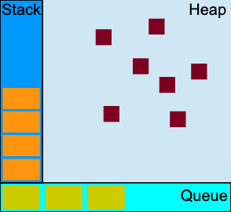
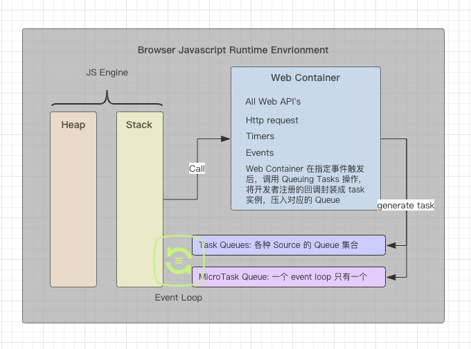

# 大话 Node.js 的 Event Loop

> 本篇文档打算对 Node.js 中的 Event Loop 的工作流程进行一次抽象整理，不会有太多的实现细节，而这些细节会在适当的位置以超链的方式导到其他的专题进行分享。

## 开胃小菜

一般在前端面试的过程中，只要你的简历中有相关 Node 的开发经验，面试官通常会问这样一个问题："Node.js 是单线程的还是多线程的？"

看到这个问题，你的答案是什么？

- 单线程的
- 多线程的

可以先思考一下，然后带着自己的答案往下看 ~

## 什么是 Event Loop, 为什么需要 Event Loop

在正式开始 Event Loop 的工作原理的探索之前，首先我们需要搞清楚 Event Loop 的来龙去脉，到底 TMD 什么事 Event Loop, 为什么需要 Event Loop， 以及在前端领域, Event Loop 基本都是和 Javascript 绑定出现，他俩之间到底有什么关系?

在正式回答上面的问题前，最后在问一个来自灵魂深处的问题：`Javascript 是什么？` (我艹，你十万个为什么呀！！！)

OK, 不兜圈子了，Javascript 其实是实现了 [ECMAScript](http://www.ecma-international.org/ecma-262/) 标准的一门解释型语言，我们也都清楚，任何程序的执行都必须先将源码（我们在编辑器中编写的文本）转换成机器码（01串），这种转化的过程依赖于语言的编译器，同样 Javascript 也有自己的编译器，而且目前 Javascript 的编译器还真不少，V8 就是其中最靓的一个，其他更多 [Javascript 编译器](https://en.wikipedia.org/wiki/List_of_ECMAScript_engines) 可以查看这里，这篇文章我们将只围绕 V8 来进行展开。

既然我们已经知道 Javascript 其实就是一门语言，那 Event Loop 就是这门语言的特性喽？

严格来说，Event Loop 和 Javscript 并没有直接关系，说的更直接点，大家在写开发过程中使用的 `setTimeout` `setInterval` `XMLHttpRequest` 等这些异步编程相关的 API 都不是 Javascript 语言提供功能，那他到底是谁提供的能力呢？准确的答案就是 `Javascript 运行时环境(Runtime Environment)`提供的, 说人话，就是浏览器以及 Node.js 环境，那 Javascript 运行时环境就这两种么？大体上来讲，是的，具体来说就有点多了，比如：各大浏览器（Chrome, FireFox, Safari...）, 移动端的 Webview, 桌面端的 Electron, nw.js，甚至是一些自定义的小程序 web 容器等都算是 Javascript 运行时环境，所以理论上来讲，任何向 Javascript 运行时提供了自定义 API 的环境都算是 Javascript 的运行时环境。

所以 Event Loop 也是这些运行时环境提供的能力。那为什么需要 Event Loop 呢？

既然到了这一步，我们就回头看看，开篇提出的问题，`Node.js 是单线程还是多线程？`

其实这个问题是有 `坑` 的，不管这是面试官故意还是无意，首先我们要清除，Node.js 是什么？从官网也好还是从我们上述的分析也罢，Node.js 其实就是一个 Javascript 的运行时环境，一个运行时除了要执行 js 脚本之外，还要负责完成各种各样的事情，比如系统 I/O 等，所以他绝对不可能是单线程的，所以，这个问题的准确答案是："Node.js 是多线程的"。那我们平时说的 XX 是单线程的，到底什么是单线程的? 答案是：`Javascript` 是单线程的。

Javascript 从设计之初仅仅是作为浏览器中的一个组件，完成用户与页面的交互的脚本，他是伴随着 Event Loop 机制，和浏览器一起问世的，所以在我们看到的所有分享 Event Loop 原理的文章中，他都是和 Javascript 一起的，估计 JS 的发明者也根本没想到他会发展为这样一门能够完成大型复杂项目的语言。

所以，Javascript 是单线程的，他只有一个执行栈，同一时间只能做一件事，而在其运行时环境提供的 Event Loop 机制的加持下，JS 可以完成看上去是并发、多线程的任务。这也正是为什么 Javascript 需要 Event Loop 的原因。总结一句话: `因为 JS 是单线程的，为了能"并发的"完成源源不断的任务，所以需要 Event Loop!`

OK, 大家清楚 Javascript 和 Event Loop 的关系了么？

### Event Loop 到底是怎么和 Javascript 配合工作的呢

为了能够彻底搞清楚 Event Loop 的工作方式，这里笔者进行了刨根问底式的探索！

不知道看到 `Event Loop` 这个名字的时候，大家有没有想过，既然 Event Loop 仅仅是一种让单线程的 JS 完成多线程任务的一种机制，为什么他的名字要叫做 Event Loop 为什么不叫做 Thread Loop 或者干脆就叫 Loop 呢？

从名字上我们就可以知道 `Event Loop` 本质上就是一个 Loop, 在代码实现上甚至都仅仅是一个 `while` 循环：

```javascript
  while(condition) {
    // loop steps ...
  }
```

那名字中的 `Event` 到底什么意思呢？

没错，就是字面意思，`事件`，不管是在浏览器环境，还是在 Node.js 环境，在页面加载完或者 app 启动之后，后续 Javascript 的执行就都是靠各种各样的事件来驱动的，没有事件，那就不会再有 js 脚本被执行。

举个🌰：

浏览器中，我们为一个元素注册了一个 click 事件的处理器（一段 js 脚本（callback），表示用户点击时要做的事情），如果用户不点击，那么这段脚本就永远不会有机会进入到 JS 执行栈中执行。

Node.js 中，我们启动了一个 HTTP Server, 并为 Server 的 `request` 事件注册了一个 callback, 在服务启动后，如果永远都没有人访问这个服务，那么 request 事件就永远不会被触发，那么注册的 request callbacke 就永远也不会被执行到。

所以，各种 Javascript 的运行时环境中的 `Event Loop` 就是循环调度各种事件对应的处理器函数（callback）, 所以，这个 Loop 的名字叫做 `Event Loop` 是不是就更合适点呢？*反问表肯定*

> 更多 Javascript 与运行时环境关系的细节，可以参考[这篇文章](./javascript-runtime-environment.md)

### Event Loop 基本模型

这一小节我们对 Event Loop 的模型进行下简单的认识

> 这小节内容主要来自于 [MDN 关于 Event Loop](https://developer.mozilla.org/en-US/docs/Web/JavaScript/EventLoop) 的分析

接下来我们看一张非常熟悉的架构图，网络中基本所有讲 Event Loop 的文章都会引用的一张图，本文也不例外，但是这里与部分网文的区别在于，我们说这张图是 `JS 运行时环境理论` 架构图，而不是 Event Loop 架构图，如上一小节所述 Event Loop 本质上就是一个位于主线程中的 `while` 循环（或类 while 循环实现）。



从上图中，我们可以看到，一个 JS Runtime Environment 基本会包含 3 个核心概念 `Stack` `Queue` `Heap`, 直译过来就是 `栈` `队列` `堆`

接下来我们就对这 3 个核心概念进行详细分析

#### Stack

`Stack` 是 JS 引擎的执行栈，FILO (First In Last Out), JS 引擎在每次执行函数都会把该函数及其相关上下文压栈，在函数执行完成后，从栈顶弹出，比如：

```js
  function foo(b) {
    var a = 10;
    return a + b + 11;
  }

  function bar(x) {
    var y = 3;
    return foo(x * y);
  }

  console.log(bar(7));
```

JS 引擎在执行时，压栈及出栈顺序如下：

1. 解析遇到 console.log 调用，先压栈
2. 接下来是 bar，再压栈
3. bar 执行时调用了 foo, foo 压栈
4. foo 执行完后，foo 出栈
5. 接下来 bar 执行完，bar 出栈
6. console.log 输出后，console.log 出栈
7. 至此 Stack 变空，Event Loop 开始调度

> 除了 js 脚本第一次加载进入由 JS 引擎解析过程中会有压栈/出栈操作外，后续的 Event Loop 将 `Queue` 中的回调调度执行过程中，也是在这个栈上进行操作的，这样再次印证，在 JS 应用的整个生命周期内，主线程只有一个 Stack（Woker除外）, 所以 JS 是一门单线程语言

#### Heap

`Heap` 是 JS 引擎用来分配对象的一个大的内存区域，JS 引擎在解析 js 代码的时候，会将遇到的变量申明，函数申明等都分配到 Heap 中

#### Queue

`Queue` 是 JS Runtime Environment 用来存储将要被 Event Loop 处理的消息的队列，FIFO(First In First Out) 每个“消息”都会对应一个回调函数，每次 Stack 空后，Event Loop 将 Queue 中最老的消息弹出处理，将合适的 callback 压入 Stack 执行，待 Stack 再次为空后，处理下一个消息。

这里的“消息”就是各个 JS Runtime Environment 中的各个事件产生的，比如浏览器中的 click, Node.js 中网络请求等等 ...

#### Event Loop

在了解了 JS Runtime Environment 中的三大核心概念后，我们是不是对 Event Loop 是什么以及干什么有一个初步的了解了？接下来我们就在说说这个 Event Loop 的一些特点以及这种模式的一些弊端：

Event Loop 最主要的一个特点就是在 Queue 中的一个消息**完全**处理里完之前，是不会处理下一个消息的，换句话讲就是*Event Loop 被阻塞了*，所以为了让在各个环境中，能快速响应，各个 Runtime Environment 都会根据事件的类型、来源制定一些策略，调度优先级等，以保证这种阻塞不被用户感知到，也就是所谓的*模拟并行*，这也是我们下一节要重点分析的。

正所谓*成也萧何败萧何*， 正应为 Event Loop 上述的特点，导致了当某个消息对应的 callback 执行了非常耗时的操作，那么 Event Loop 就是被阻塞比较长的时间，这时候，在浏览器中的表现就是页面卡顿，Node 服务的表现就是请求堆积，甚至拒绝服务！所以，在浏览器端和 Node 开发都会有很多开发实践来避免 Event Loop 被阻塞较长时间。

> - 高效 Node 开发实践，可以参考这篇[文章](./effective-nodejs.md)
> - JS Runtime Environment 详解可以参考这篇[文章](./javascript-runtime-environment.md)

### 接下来我们就具体整理下两大 JS 运行时环境中的事件, 以及每次 Loop 做的事情

基本上所有的 JS Runtime Environment 都是基于上述的 Event Loop 的基本模型来实现各自的 Loop 细节的，本节内容就对目前最流行的两大平台 Chrome 和 Node.js 中的 Event Loop 细节进行探索。

#### 浏览器中的 Event Loop

浏览器中的 Event Loop 的实现规范是在 [HTML Living Standard](https://html.spec.whatwg.org/multipage/webappapis.html#event-loops) 中定义的！惊讶么？虽然所有解析 Event Loop 的文章都是和 Javascript 绑定出现的, 但是确确实实他的规范定义并不是在 Ecamscript 当中，而且更令你惊讶的是(*截止笔者写这篇文章的时间：2019/10/29*)Chrome 浏览器中关于 `Promise` 相关的 `Job Queue` 也不是调用 V8 引擎提供的接口 。

[HTML 规范文档](https://html.spec.whatwg.org/multipage/webappapis.html#integration-with-the-javascript-job-queue) 第 8.1.3.7 章有如下说明：

> However, as of the time of this writing the definition of EnqueueJob in that specification is not sufficiently flexible to integrate with HTML as a host environment.
>
> As such, user agents must instead use the following definition in place of that in the JavaScript specification. These ensure that the promise jobs enqueued by the JavaScript specification are properly integrated into the user agent's event loops.

大概意思就是说，由于 Ecmascript 规范中定义的 Job Queue 的实现是不够灵活可扩展的，为了能让 Promise 的 Job Queue 能够以一种兼容目前浏览器的方式集成到浏览器中，浏览器必须自己去实现 Promise 相关的实现，而不是使用 JS 引擎提供的 API

目前的情况就是这样的，按照正常的逻辑，两套实现肯定是不可取的，所以在不就的将来，可能就会发生变化，而且按照 Chrome 的发版进度已经 Emcascript 规范一年一版的进度，估计 Chrome 会是第一个统一这套的浏览器。而且 Node.js 中是不存在这样的差异的。

介绍完这些背景后我们就开始正式介绍浏览器中 Event Loop 的实现。

在浏览器中，为了协调各种事件，用户界面渲染，脚本执行，网络请求等，我们不得不引入 Event Loop, 浏览器的 JS Runtime Environment 就是基于上一节的基础模型实现的，具体的区别在于 对 `Queue` 的丰富上，具体体现在以下三个概念和两个入队列算法（queue task）：

> 在 HTML 规范中，通常会使用 `User Agent` 这样的字样来表示实现了这套规范的用户终端，我们常用的浏览器，移动端的 webview 就属于这类范畴，为了方便表述与理解，下文中，我们均使用浏览器来代表规范中的 `User Agent`

##### `Task`

浏览器中一切皆任务，比如：事件派发（dispatching event），HTML 解析 (HTML Parsing), 调用回调（calling callback）, 异步流程中获取资源（fetching resource）, 响应 DOM 操作等都是有专门的任务来完成的。

每一个任务在代码层面其实就是一个包含了如下字段的数据结构：

```bash
  {
    `steps`: 指定该任务要完成的动作
    `source`: 表示该任务的来源或者说是该任务的类型，这个字段是非常重要的，每个 Task 必须关联一个具体的来源， 每一类来源的 Task 都会对应一个 Task Queue, 而在 Event Loop 循环处理任务的时候，会先选一个 task queue, 然后从 task queue 中挑选一个可执行的 task 进行处理，这里 Event Loop 在选择 task queue 的时候，就是根据这个 source 以一定的策略选择的。比如：Event Loop 在选则 task queue 的时候，用户交互类来源的 task queue 会比其他来源的 task queue 拥有更高的概率被选中执行，以便给用户更积极的相应
    `document`: 如果该任务是在 `window event loop` 中产生的，那么该 Task 就是关联一个 document 对象，否者这个字段就是 null
    `context`: js 脚本执行的环境上下文
  }
```

每个任务其实还有一个状态用来标识这个任务是否已经处于可执行状态，通常 `task.documnet` 是 null 或者所关联的 document 都处于 active 状态时，就表示该任务已经处于可执行状态。

timer （setTimeout, setInterval）也是一个任务，只不过 task.source 是 timer 类，在等待指定的延迟时间后，该 task 被压入 task queue 等待被调用，这也正是为什么 timer 关联的 callback 不会被准时调用的原因，因为 Event Loop 当时可能正在处理其他的任务，所以 timer 指定的 delay 时间，其实是需要等待的最少时间，即使 delay time 设置为 0 他也不会被立即调用到，更多 timer 的实现细节，我们可以查看 [timer 实现细节](./timer-implamentation.md) 一文。

一些常见的任务来源：

- DOM manipulation task source: 表示 DOM 操作类型的任务，比如：在非阻塞流程中，元素被插入 documention 中
- User interaction task source: 表示用户交互类任务，比如：keyboard, mourse 输入事件等
- Networking task source: 表示网络请求类任务
- History traversal task source: 表示浏览器的浏览记录操作类任务，比如：history.pushState，history.back, history.replace 等操作

##### `Task Queue`

`Task Queue` 其实也是很多网文中的 `MacroTask Queue` 或者是宏任务，其实在 HTML Living Standard 已经 ECMAScript Spec 中都没有 MacroTask 的定义，可能更多的是为了与 `MicroTask` 形成对比，被某位大佬臆想出来的名称吧，单纯的从语义对比上看，其实也挺合理的，但是从整个浏览器的实现来看，Task 可能更准确点，毕竟每个任务都是一个具体特定的任务，根本没有“宏”的概念在里面，所以，本文准守规范中的名称，依旧使用 Task Queue 来进行说明。

Task Queue 其实并不是一个 FIFO 的 Queue, 而是一个 Set, 在后续 Event Loop 的处理流程中，我们也可以感受到，在 Event Loop 从选中的 Task Queue 中选择一个可执行的任务，而不是从 Queue 中弹出一个任务可以看出，Event Loop 在处理 Task Queue 时，并不是有序的执行，而是根据 task 的可执行状态以及等待的时长等其他因素进行，综合选择的。

而且在介绍 Task 的过程中，我们也了解到，同一类来源的任务会有一个 Task Queue 来维护，所以一个 Event Loop 可能会拥有多个 Task Queue.

##### `Microtask Queue`

Microtask 其实也是一个 Task，只不过他是通过特定的流程创建的，而且他的 source 就是 `microtask task source`, 这里需要纠正一个说法，那就是 “microtask 拥有更高的调度优先权” 其实是不准确的，至于原因，我们会在 Event Loop 的执行流程中进行解释。

Microtask Queue 顾名思义，就是用来维护 microtask 的队列，这个 microtask queue 和 task queue 就不一样的，他是一个真正意义上的 FIFO 的 Queue(队列)，而且每个 Event Loop 只拥有一个 microtask queue.

能产生 microtask 的 API 有如下：

- Promise.then
- MutationObserver
- window.queueMicrotask
- ~~Object.observe~~

##### `Queuing tasks` & `Queuing microTasks`

将 Task 和 microTask 压入 Queue 的执行步骤基本相同，所做的事情无非就是为 task 实例的属性设置值（在 [Task](#task) 小节可以了解到一些基础的属性），主要的区别在于以下两点：

1. 他们的 task source 是不一样的，microTask 的 `source` 属性为 `microtask source` 其他普通的就各不一样了
2. 进入 Queue 是姿势不一样，由于 Task Queue 本质上是 Set, 所以 `Queuing a Task` 执行的是 `append` 操作，而 microTask 就是 `enqueue` 操作

> 其实这一小节的内容，对于正常的业务开发来说并没有太大的影响，不知道也完全不阻碍大家写出优秀的代码，但是知道他，但是知道他，你无意中就会避免一些坑。

##### Event Loop 的处理流程

OK，在介绍完上述的概念后，结合 Event Loop 的基础模型，我们不难得出下面浏览器中的 JS Runtime Environment 的抽象模型：



我们简单的介绍下浏览器是怎么按照上述的模型工作的，然后我们重点介绍下上述模型中 Event Loop 的具体工作流程。

打开浏览器，浏览器初始化好 Runtime Environment, 启动 Event Loop, 在加载完 js 文件开始从上到下解释执行(其实我们可以把这个过程也理解为一个 Task)，遇到声明则在 Heap 中分配空间，遇到调用则压如 Stack 开始执行对应的调用，执行过程中遇到 Web API 调用，怎在 Web Container 中注册对应的回调，直到整个 js 文档被执行完成后，Stack 也为空，这时候第一个 Task 已经完成执行，然后开始清空 microTask Queue，然后周而复始，直到你关闭当前页面。

Event Loop 工作的具体步骤如下：

1. Event Loop 先从关联的所有的 Task Queues 中选择一个 Task Queue, 选中的 Task Queue 中至少的有一个 task 是处于可执行状态（runnable）的
2. 从选中的 task queue 中选择第一个处于 runnable 的 task, 并将他从当前 Queue 中移除
3. 在开始执行选中的 task 前，做点标记
4. 开始执行选择 task.steps，而用户注册的 callback 就是写 steps 中的一步
5. 执行完成后，开始进行 `[perform a microtask checkpoint](https://html.spec.whatwg.org/multipage/webappapis.html#perform-a-microtask-checkpoint)`, 这一步不错过多解释，直接理解成清空 microTask Queue 中的所有任务，也就是将 microTask queue 中的所有任务的 callback 依次压入 JS Stack 中执行。
6. 清空 Microtask Queue 后，再次做点标记
7. 进行一次浏览器渲染更新，在浏览器渲染更新的阶段，还会 `run the animation frame callback` 也就是执行 `requestAnimationFrame` 的 callback, 更新完成后，再次做标记
8. 渲染完成之后，判断 Task Queues 是否已经没有符合条件的 Task, 且 Microtask 是否为空，且无需再进行浏览器渲染，且 Event Loop 是 window event loop 这时候 Event Loop 进入空闲等待阶段, 这时候,就会 `[start an idle period algorithm](https://w3c.github.io/requestidlecallback/#start-an-idle-period-algorithm)` 说白了,就是开始执行调用 `requestIdleCallback` 的回调，如果开始的条件不满足，那就从第一步继续循环，直到满足空闲的条件
9. 都执行完后，再次做标记，设置一次 loop 结束的时间

> 完整的执行流程可以参照 [完成 Event Loop 的执行步骤](https://html.spec.whatwg.org/multipage/webappapis.html#event-loop-processing-model)，上述为了方便理解，在不影响大体正确性的情况下，适当的做了点精简。

为了验证以上步骤，我们可以执行以下代码：

```javascript
  console.log('start: 0')

  setTimeout(() => {
      console.log('1')
  }, 0)

  Promise.resolve().then(() => {
      console.log('2-1')
  })

  queueMicrotask(() => {
      console.log('2-2')
  })

  requestAnimationFrame(()=> {
      console.log('3-1')
  })

  requestAnimationFrame(() => {
      console.log('3-2')
  })

  requestIdleCallback(() => {
      console.log('4-1')
  })

  requestIdleCallback(() => {
      console.log('4-2')
  })

  console.log('end:5')
```

在 Chrome 中的执行结果如下：

```bash
  start:0
  end:5
  2-1
  2-2
  3-1
  3-2
  1
  4-1
  4-2
```

从执行结果来看，是符合上述执行步骤的

> 更多好文
>
> 我们可以参照 [Loupe](http://latentflip.com/loupe/) 站点查看动态效果
>
> 以及更多 [Task, Microtask调度](https://jakearchibald.com/2015/tasks-microtasks-queues-and-schedules/)

#### Node.js 中的 Event Loop

Node.js 中的 Event Loop 的执行步骤和 Browser 中的差别还是很大的，尽管 Node.js 的最新版本中，在向浏览器靠近。由于篇幅限制，Node.js 的 Event Loop 详解，我们在 [这篇文章](./event-loop-in-node.js.md)

## Reference

- [MDN Event Loop 基础模型](https://developer.mozilla.org/en-US/docs/Web/JavaScript/EventLoop)
- [Understanding JS: Event Loop](https://hackernoon.com/understanding-js-the-event-loop-959beae3ac40)
- [Event Loop explainer](https://github.com/atotic/event-loop)
- [Task, microtask, queues and schedules](https://jakearchibald.com/2015/tasks-microtasks-queues-and-schedules/)
- [从 Chrome 源码看 Event Loop](https://juejin.im/post/5bdec7d551882516ce4e4d10)
- [Javascript Runtime Environment](https://medium.com/@olinations/the-javascript-runtime-environment-d58fa2e60dd0)
- [Concurrency model and the event loop](https://developer.mozilla.org/en-US/docs/Web/JavaScript/EventLoop)
- [Lazy javascript parse in v8](https://www.mattzeunert.com/2017/01/30/lazy-javascript-parsing-in-v8.html)
- [V8 preparser](https://v8.dev/blog/preparser)
- [Repaint and Reflow](https://medium.com/darrja-%E0%A4%A6%E0%A4%B0%E0%A5%8D%E0%A4%9C%E0%A4%BE/what-the-heck-is-repaint-and-reflow-in-the-browser-b2d0fb980c08)
- [The event loop from inside out](https://www.youtube.com/watch?v=P9csgxBgaZ8)

----

> 以下内容为阅读规范文档时的记录，会比较乱, 不具有系统性的参考价值

Realm Record 表示一个 Script 被加载后，执行前所关联的范围，或者说是相关环境，这个值会作为 Script Records 对象中 `realm` 字段的值

## 浏览器中的脚本 script

我们在浏览器中加载 script 时候，在最终的实现里，无非就是一个结构对象

规范中的 `classic script`、 `module script`、`active script`

- classic script 表示拥有一个额外信息的脚本，这个额外信息是一个 boolean 值，通常情况下是 true, 表示脚本如果发生错误，可以提供完成的错误信息；如果脚本是跨域脚本，这时候，这个值就是 false, 加载的脚本中的发生的错误会被浏览器屏蔽掉，避免私有信息泄露。

- module script 没有以上额外信息的脚本

- active script 目前只用于 `import()` 功能

### script 加载算法

脚本的加载算法是通过脚本模型上的 fetch options 来控制的：fetch option 包含以下内容：

- 密码名词元数据 (cryptographic nonce) 用来初始化加载 default: ""

- 完整性 元数据 (integrity metadata) 用来初始化加载 default: ""

- 编译器 元数据 (parser metadata) 用来初始化加载 default: "not-parser-inserted"

- 凭证模式 (credentials mode) 用来初始化加载, default: "same-origin"

- 引用策略 (referrer policy) 用来初始化加载 default: ""

#### classic script 的加载算法 注意事项

- 如果脚本加载失败了，或者请求的状态是非 200 则异步结束脚本加载，否者同步结束

## 事件队列注意事项

1. 浏览器中有各种各样的 Event Loop
2. 每个 Event Loop 至少要有一个 task queues
3. task queue 其实并不是队列，而是一个 set, 因为 event loop 的第一步其实是从 task queue 中选第一个出入可执行状态的任务
4. microtask queue 不是上述的 task queue
5. 浏览器中有各种各样的 task queue, 每个 task queue 只用来收集同一类来源(task source)的 task
6. 每个 event loop 都会有要给正在运行的 task，要不就是一个 task 要不就是 null
7. 每个 event loop 都有一个 microtask queue, 其实 microtask 只是对某类特殊 task 的称呼，他是由特殊的流程去创建的
8. 每个 event loop 都有一个 performing microtask checkpint 布尔值，用来避免重复调用 microtask 检测机制
9. 每个 event loop 都有一对 loop start 和 loop end 的值，初始时为 unset

### event loop 的处理流程

event loop 必须持续的执行以下步骤直到其退出(即：所在的线程结束退出)

> 从规范文档看，每执行完一个 Task (所谓的 macrotask)，就会进行一次 microtask 检查, 检查过程中，只要 event loop 的 microtask queue 不为空，就会一直 dequeu，直到所有 microtask 被执行完
> 而且每次进行 mircotask 检查后，就要进行浏览器渲染

### Timer 内部逻辑

在每个 Window 或者 Worker 的全局作用域中都有一个 list 用来保存 `setTimeout` 或者 `setInterval` 方法创建的 timer, 每个 timer 都有一个全局唯一的 id (类似 list 的索引)

> 需要注意的是，由于 clearTimeout 和 clearInterval 都是从相同的 list 中清除 Timer, 所以这两个方法都可以用来清除任意一种类型的 timer
